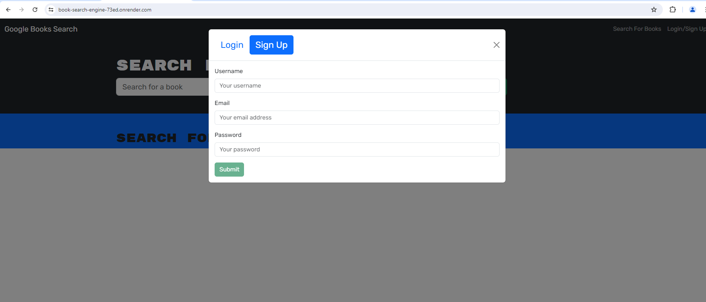
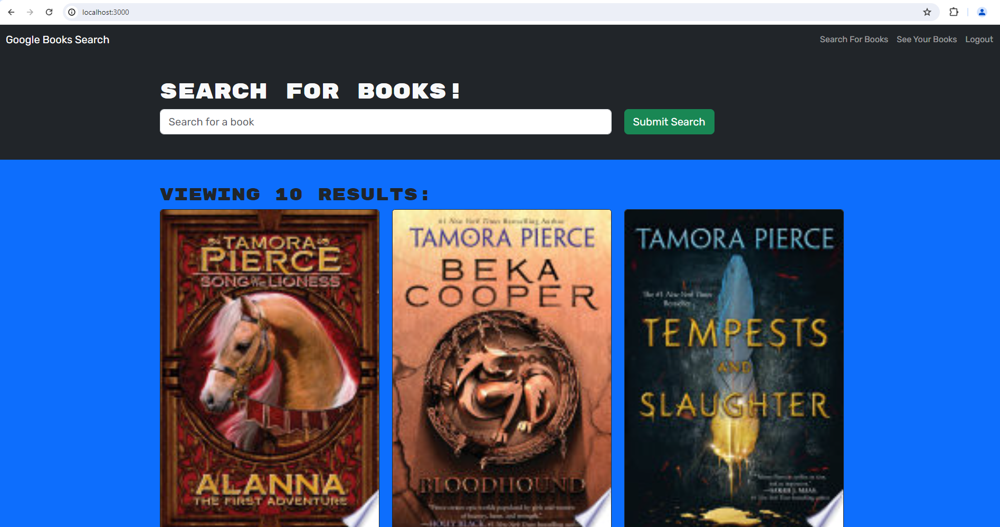
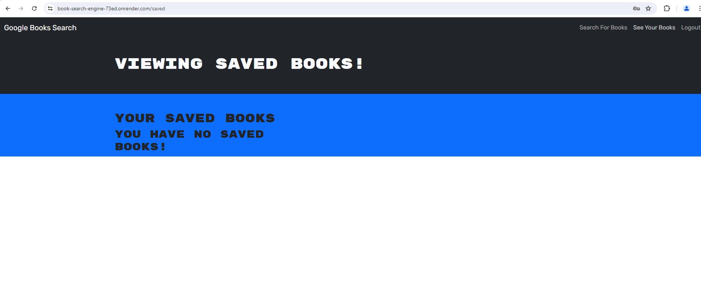
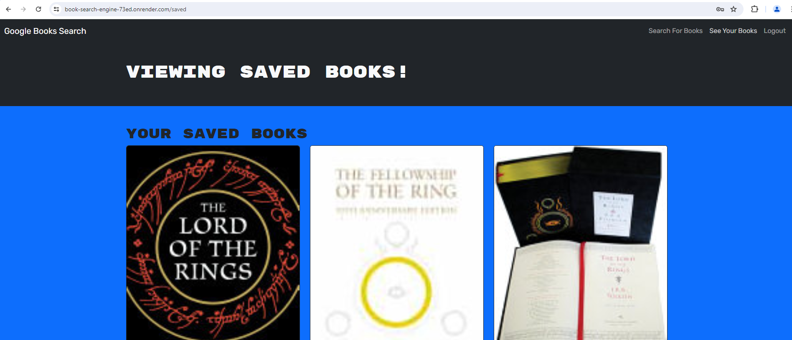
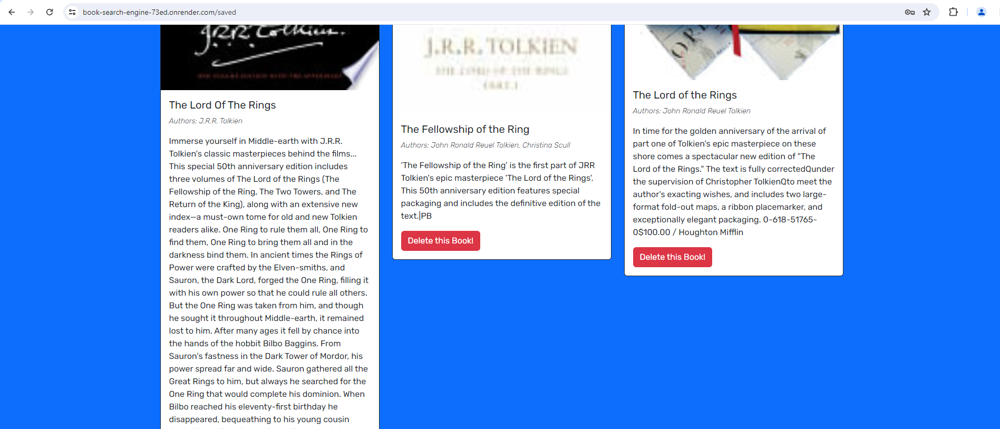

# Book-Search-Engine
A MERN stack with React front end to search for books and make a list

## Description

This project is to convert starter code, a fully functioning Google Books API search engine built with a RESTful API, into a GraphQL API, built with Apollo Server.

To set up this project, I need to:

    1. Set up an Apollo Server to use GraphQL queries and mutations to fetch and modify data, replacing the existing RESTful API.

    2. Modify the existing authentication middleware so that it works in the context of a GraphQL API.

    3. Create an Apollo Provider so that requests can communicate with an Apollo Server.

    4/ Deploy my application to Render with a MongoDB database using MongoDB Atlas. Use the Deploy with Render and MongoDB Atlas walkthrough for instructions.

## User Story

```md
AS AN avid reader
I WANT to search for new books to read
SO THAT I can keep a list of books to purchase
```

## Acceptance Criteria

```md
GIVEN a book search engine
WHEN I load the search engine
THEN I am presented with a menu with the options Search for Books and Login/Signup and an input field to search for books and a submit button
WHEN I click on the Search for Books menu option
THEN I am presented with an input field to search for books and a submit button
WHEN I am not logged in and enter a search term in the input field and click the submit button
THEN I am presented with several search results, each featuring a book’s title, author, description, image, and a link to that book on the Google Books site
WHEN I click on the Login/Signup menu option
THEN a modal appears on the screen with a toggle between the option to log in or sign up
WHEN the toggle is set to Signup
THEN I am presented with three inputs for a username, an email address, and a password, and a signup button
WHEN the toggle is set to Login
THEN I am presented with two inputs for an email address and a password and login button
WHEN I enter a valid email address and create a password and click on the signup button
THEN my user account is created and I am logged in to the site
WHEN I enter my account’s email address and password and click on the login button
THEN I the modal closes and I am logged in to the site
WHEN I am logged in to the site
THEN the menu options change to Search for Books, an option to see my saved books, and Logout
WHEN I am logged in and enter a search term in the input field and click the submit button
THEN I am presented with several search results, each featuring a book’s title, author, description, image, and a link to that book on the Google Books site and a button to save a book to my account
WHEN I click on the Save button on a book
THEN that book’s information is saved to my account
WHEN I click on the option to see my saved books
THEN I am presented with all of the books I have saved to my account, each featuring the book’s title, author, description, image, and a link to that book on the Google Books site and a button to remove a book from my account
WHEN I click on the Remove button on a book
THEN that book is deleted from my saved books list
WHEN I click on the Logout button
THEN I am logged out of the site and presented with a menu with the options Search for Books and Login/Signup and an input field to search for books and a submit button  
```

## Access

To access the repository for this site please visit: https://github.com/avilwock/Book-Search-Engine.

To access the project deployed through Render, please visit: https://book-search-engine-73ed.onrender.com/

## Usage

To use this site, please visit the above link. You will need to sign up with a username, email, and password.



Once signed up you can view books by typing the titles, authors, or keywords into the search engine.




To save a book to your list, click on the button underneath the book that says, 'Save This Book!'. To view your saved books, please click the See Your Books link at the top of the page on the right. On this page if you have books they will be displayed on the page, if not it will say you have no books saved.




 To remove a book from your list, please click 'Delete Book'.

 

## Credits

With thanks to:

Logan Garland, Coding Bootcamp, University of Irvine California

## License

MIT License
